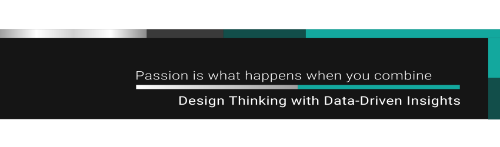
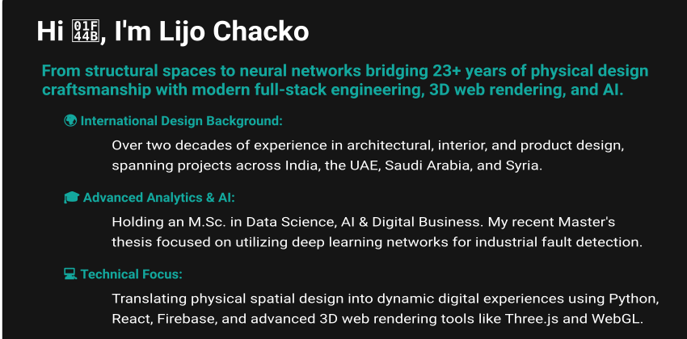

  <!-- Top Custom Banner -->
  
  
  <!-- About Me SVG Card -->
  

### 🏛️ Technical & Design Pillars

**Spatial & Product Design**
* Architectural & Interior Design
* 3D Modeling & Visualization
* Rhino, Blender, CAD
* Physical Prototyping

**Data Science & AI**
* Deep Learning & Neural Nets
* PyTorch, TensorFlow, Keras
* Predictive System Modeling
* Pandas, NumPy, Scikit-Learn

**Full-Stack & Interactive**
* Python, JavaScript, Rust
* React, Tailwind, Firebase
* Three.js & WebGL
* Tauri Cross-Platform Apps
 

## Socials:
 

 

## Tech Stack:
                                   

 

## GitHub Stats

  

### Quotes

  

